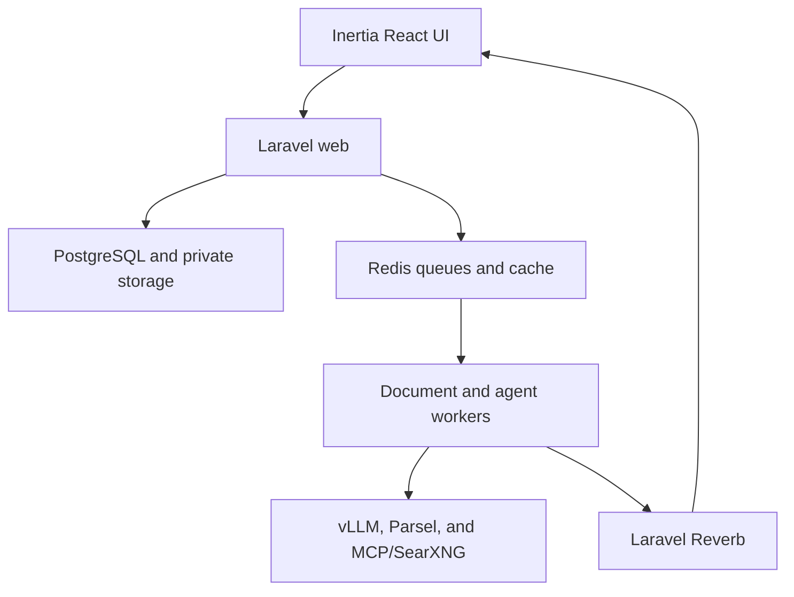

# Internal Qwen Gateway V0

**Product and technical specification**  
**Status:** Approved design draft  
**Date:** 2026-07-20  
**Audience:** Engineering, infrastructure, security, and technical pilot users

## 1. Summary

Build a small internal chat application that gives company users controlled access to a self-hosted Qwen model.

The product should feel like a deliberately smaller Open WebUI or LibreChat: fast chat, streamed responses, useful tool progress, document reading, web research, and downloadable generated artifacts. It is not intended to reproduce either product's entire feature set.

V0 is a Laravel 13 modular monolith using:

- PHP 8.4, required by the selected Parsel integration
- Laravel AI SDK against a private OpenAI-compatible vLLM endpoint
- `Qwen/Qwen3-Coder-Next-FP8`
- Laravel queues and Horizon for durable agent execution
- Laravel Reverb and Echo for live progress and response streaming
- Laravel MCP for direct consumption of a fixed SearXNG MCP server
- Parsel for local document extraction and OCR fallback
- Inertia, React, TypeScript, Tailwind, shadcn, and Base UI
- PostgreSQL and Redis
- Docker Swarm with strict separation between CPU application nodes and the GPU inference node

The prototype serves a small group of developer and technical users. It intentionally excludes email access, SSO, arbitrary MCP servers, cross-conversation workspaces, RAG, multiple models, and a plugin marketplace.

## 2. Goals

V0 must let an authenticated user:

1. Chat with the self-hosted Qwen model and receive a streamed response.
2. Attach supported files and ask questions about their contents.
3. Explicitly enable web access for a message so the model can search and read public pages.
4. Ask the model to create a downloadable Markdown, TXT, JSON, or CSV artifact.
5. Combine document reading, web research, artifact creation, and a final response in one durable agent run.
6. Leave or close the browser without terminating the run.
7. Return later and recover the current or completed state.
8. Delete a conversation and immediately lose access to all related data and UI.

The admin must be able to:

1. Create, disable, and reactivate users.
2. Reset a user's temporary password.
3. Observe service health and run failures without automatically reading user conversations.
4. Disable web search or uploads globally.

## 3. Non-goals

The following are explicitly outside V0:

- Public registration
- Socialite, SSO, or directory synchronization
- Gmail, Outlook, or other email access
- Sending or replying to email
- Arbitrary user-configured MCP servers
- Multiple models or inference providers
- Model selection in the chat interface
- User-created agents or system prompts
- Shared conversations or team workspaces
- Cross-conversation file reuse
- A persistent personal file workspace
- Embeddings, vector search, or RAG
- `transformers-php`
- Image generation, image uploads, and voice
- Conversation branching or message editing
- Automatic conversation summarization
- A plugin or connector marketplace
- Native mobile applications
- High availability, multi-region deployment, or a production SLA
- Kubernetes, a service mesh, or separate application microservices
- SSE or an external Laravel SSE package

These features require a separate proposal after the pilot demonstrates a real need.

## 4. Locked product decisions

| Area              | V0 decision                                                                  |
| ----------------- | ---------------------------------------------------------------------------- |
| Users             | Small developer/technical pilot                                              |
| Authentication    | Admin-created email/password accounts; registration disabled                 |
| Roles             | `member` and `admin`                                                         |
| Model             | `Qwen/Qwen3-Coder-Next-FP8` served by vLLM                                   |
| Application shape | Laravel modular monolith                                                     |
| Agent execution   | Durable queued `agent_run` for every assistant response                      |
| Live delivery     | Private Reverb WebSocket channels                                            |
| Web access        | Self-hosted SearXNG through a fixed MCP server; opt-in per message           |
| Documents         | PDF, TXT, CSV, and XLSX; local extraction with OCR fallback for scanned PDFs |
| Generated files   | Conversation-scoped Markdown, TXT, JSON, and CSV artifacts                   |
| Retention         | Persist until user deletion; soft deletion with cascade                      |
| Deployment        | Docker Swarm; application and GPU workloads on different nodes               |
| Admin privacy     | Operational metadata by default, not raw conversation content                |

## 5. User experience

### 5.1 Frontend stack

The frontend stays inside the Laravel repository:

- Inertia
- React and TypeScript
- Tailwind
- shadcn components using Base UI primitives
- Laravel session authentication and CSRF protection
- Laravel Echo connected to Reverb

There is no separate Next.js deployment and no public token-based API in V0.

### 5.2 Member screens

| Screen   | Required behavior                                                                     |
| -------- | ------------------------------------------------------------------------------------- |
| Login    | Email and password; force temporary-password change when applicable                   |
| Chat     | Conversation sidebar, new chat, history, composer, attachments, and Web toggle        |
| Response | Streamed sanitized Markdown, code highlighting, copy actions, citations, and progress |
| Artifact | Small inline preview and authorized download                                          |
| Account  | Change password and sign out                                                          |

Conversation titles initially use a trimmed version of the first user message. Users may rename or delete a conversation.

Only one assistant run may be active in a conversation. A user may stop an active run or retry a failed run. V0 does not support regenerating successful messages into branches.

### 5.3 Tool activity

The response UI shows understandable activity rather than raw internal traces:

- Reading attachments
- Searching the web
- Reading sources
- Creating artifact
- Generating response

Completed tool activity may be shown in a collapsed summary. Chain-of-thought is never requested, displayed, or stored.

### 5.4 Web toggle

The composer includes a `Web` toggle that applies only to the message being sent.

- When disabled, web MCP tools are not provided to the model.
- When enabled, the model may perform multiple searches and public-page reads without interrupting the run for individual approvals.
- The UI explains that SearXNG may forward generated search queries to upstream public search engines.

This boundary reduces the chance of content from a confidential company document being unexpectedly included in a public search query.

### 5.5 Conversation deletion UX

After a conversation is deleted, every connected tab must:

1. Remove it from the sidebar.
2. Hide its messages, tool panels, attachments, and artifact panels.
3. Ignore late events belonging to its runs.
4. Unsubscribe from its run channels.
5. Redirect to a blank `/chat` screen when the deleted conversation was open.

The UI must reach the same result on refresh even if it missed the WebSocket event.

## 6. Architecture

The system is one Laravel codebase with several runtime roles. Runtime roles are not independently owned microservices.

### 6.1 Laravel modules

Use ordinary Laravel namespaces, models, policies, actions, services, events, and jobs organized around these domains:

- Identity
- Conversations
- Agent Runs
- Uploads and Documents
- Tools and MCP
- Artifacts
- Administration

Do not add a module framework, internal package ecosystem, event-sourcing system, or elaborate DDD layer to V0.

### 6.2 Runtime roles

The same application image runs as:

- HTTP web application
- `agents` queue worker
- `documents` queue worker
- Reverb server
- Scheduler, exactly one replica
- Horizon, exactly one operational instance

Supporting runtime services are PostgreSQL, Redis, SearXNG, the SearXNG MCP server, private persistent storage, and vLLM.

The application image targets PHP 8.4 because that is required by the selected Parsel package.

Laravel Boost is a development dependency. It helps agents and developers understand and work on the Laravel application, but it is not part of the production request path and is not the runtime gateway driver.

## 7. Docker Swarm deployment

### 7.1 Required topology

The minimum pilot Swarm contains two different physical nodes:

| Node                      | Labels                      | Workloads                                                                                                         |
| ------------------------- | --------------------------- | ----------------------------------------------------------------------------------------------------------------- |
| CPU application/data node | `workload=app`, `data=true` | Reverse proxy, Laravel web, workers, Reverb, scheduler, Horizon, PostgreSQL, Redis, private storage, SearXNG, MCP |
| GPU worker node           | `workload=gpu`, `gpu=true`  | vLLM only                                                                                                         |

The nodes belong to the same Swarm and communicate over a private overlay network, but the web application never runs on the GPU node.

Placement constraints are hard requirements:

- Every Laravel and data-plane service requires `node.labels.workload == app`.
- vLLM requires `node.labels.workload == gpu` and `node.labels.gpu == true`.
- Stateful services additionally require `node.labels.data == true`.
- If the CPU application node is unavailable, application tasks remain pending. They must not spill onto the GPU node.
- If the GPU node is unavailable, vLLM remains pending and the gateway reports model unavailability.

Docker documents both node-label placement constraints and NVIDIA GPU advertisement through Swarm generic resources. The GPU node must advertise the available NVIDIA GPU resource, have NVIDIA Container Toolkit configured, and pass a deployment smoke test before the application pilot begins.

### 7.2 vLLM service

The vLLM service uses a pinned official `vllm/vllm-openai` image and:

- Runs only on the GPU node
- Reserves the advertised NVIDIA GPU generic resource
- Uses the NVIDIA container runtime
- Has sufficient shared memory through host IPC or an explicit shared-memory allocation
- Mounts a persistent model cache on the GPU node
- Publishes no public port
- Is reachable only by authorized internal application services
- Exposes a health check to the internal network

The exact Swarm GPU reservation syntax must be validated against the installed Docker Engine and NVIDIA Container Toolkit versions. This is a deployment prerequisite, not an assumption to discover during rollout.

### 7.3 Networks and ingress

- Only the reverse proxy publishes user-facing HTTP/HTTPS ports.
- Reverb is routed through the reverse proxy.
- vLLM, PostgreSQL, Redis, SearXNG, and MCP do not publish public ports.
- SearXNG and the URL reader receive restricted internet egress.
- Document workers should not have general internet egress.
- Service credentials use Docker Swarm secrets where possible; non-secret tuning uses environment configuration.

### 7.4 Storage limitation

For V0, stateful services and all Laravel roles that require file access are pinned to the CPU application/data node and share a private persistent volume. Swarm does not make a node-local volume portable.

Adding more application nodes later requires shared object storage or a distributed filesystem and is not part of V0.

## 8. Model and framework contract

### 8.1 Qwen and vLLM

Use an exact pinned revision of `Qwen/Qwen3-Coder-Next-FP8`. The model card currently specifies vLLM `>= 0.15.0`, automatic tool choice, and the `qwen3_coder` tool-call parser.

The deployment must enable:

- OpenAI-compatible chat completions
- Streaming
- Automatic tool choice
- `qwen3_coder` tool parsing
- Streaming usage metadata
- A served model alias stable across deployments
- Private API authentication or an equivalent private-network boundary

V0 sends tool calls sequentially with `parallel_tool_calls=false`.

Although the model supports a larger native context, the gateway starts with a 64K context budget. The vLLM maximum and gateway budget are pinned together and raised only after memory, latency, and concurrency testing.

### 8.2 Laravel AI SDK

Configure Laravel AI SDK's OpenAI-compatible provider with the internal vLLM base URL. The application owns lifecycle and persistence through `agent_runs`; SDK streaming and broadcasting are implementation mechanisms, not the source of truth.

The SDK version is pinned. A live contract test must cover streaming, tool-call parsing, usage reporting, cancellation, and the exact model/vLLM combination.

## 9. Durable agent-run lifecycle

### 9.1 Submission

When a user sends a message, Laravel performs one database transaction that:

1. Authorizes the conversation and every referenced upload.
2. Creates the user message.
3. Associates uploads with that message.
4. Creates an `agent_run` with the message's `web_enabled` decision.
5. Dispatches preparation after the transaction commits.

The HTTP request returns `202 Accepted` with the message and run identifiers. It does not remain open for model generation.

### 9.2 Preparation

The run enters `preparing` while required upload extractions finish on the `documents` queue. Uploads that were already extracted are reused.

The agent job begins only when every required extraction is ready. A failed required extraction fails the run with a specific attachment error.

### 9.3 Execution

One job on the `agents` queue owns the model/tool loop:

1. Assemble the system policy, recent conversation context, attachment manifest, and allowed tools.
2. Start streaming from vLLM through Laravel AI SDK.
3. Validate every requested tool invocation.
4. Execute allowed tool calls sequentially.
5. Feed bounded tool results back to the model.
6. Continue until the model returns a final response or a limit is reached.
7. Persist the final assistant message, citations, tool metadata, usage, and artifact relationships.

Document extraction remains a separate queue workload. Web searches, public-page reads, and small artifact writes execute synchronously inside the owning agent job with strict timeouts. V0 does not create another queue job for every small tool call.

### 9.4 States and phases

Durable states:

`queued -> preparing -> running -> completed`

Terminal alternatives:

- `failed`
- `cancelled`

User-facing phases are live progress values and may include `reading_attachments`, `searching_web`, `reading_sources`, `creating_artifact`, and `generating_response`.

### 9.5 Persistence and reconnect

- Reverb token deltas are ephemeral and are not inserted individually into PostgreSQL.
- The current assistant draft is checkpointed periodically rather than per token.
- The final message is persisted atomically with run completion.
- On page load or reconnect, the browser fetches the current run snapshot before resuming live events.
- The database remains authoritative when a WebSocket event is delayed or missed.

### 9.6 Cancellation

Cancellation sets `cancel_requested_at`. The worker checks it while reading model stream events and before and after tool calls.

When possible, the worker closes the in-flight vLLM stream. No new tool side effects may begin after cancellation. The partial response is retained with a cancelled status so the user can see what happened.

## 10. Tools and MCP

### 10.1 V0 tool allowlist

| Tool                 | Source          | Capability                                                   |
| -------------------- | --------------- | ------------------------------------------------------------ |
| `read_document`      | Laravel tool    | Read bounded text from an authorized conversation attachment |
| `create_artifact`    | Laravel tool    | Create one supported file in user-scoped artifact storage    |
| `searxng_web_search` | Native MCP tool | Search through SearXNG when Web is enabled                   |
| `web_url_read`       | Native MCP tool | Read a public HTTP/HTTPS page when Web is enabled            |

There is no shell, SQL, raw filesystem, email, arbitrary HTTP, internal-network browsing, or generic MCP-management tool.

### 10.2 Direct MCP consumption

Laravel MCP connects directly to one deployment-configured Streamable HTTP endpoint for `mcp-searxng`. No PHP wrapper is required around its native tools.

Direct consumption does not mean unrestricted discovery. The gateway must:

- Pin the MCP server version.
- Authenticate the connection.
- Import only the exact approved tool names.
- Register web tools only when the message has `web_enabled=true` and the global feature is enabled.
- Apply connection and execution timeouts.
- Bound results before returning them to Qwen.
- Never accept an MCP URL from a user.
- Never automatically expose newly advertised tools.

### 10.3 Trust policy

Model output, model-selected arguments, document text, web pages, and MCP responses are all untrusted.

Every Laravel tool invocation must recheck:

- The authenticated user
- Resource ownership
- Conversation and run state
- Tool availability for this message
- Argument schema and size limits
- Cancellation and deletion state

Automatic tool choice in vLLM does not replace application validation.

## 11. Web research

V0 operates a private SearXNG instance and the community `ihor-sokoliuk/mcp-searxng` server.

The search stack has no per-query paid API dependency, but upstream public search engines may rate-limit, block, or challenge automated traffic. The product must treat web availability as best-effort rather than guaranteed.

`web_url_read` may access only public HTTP/HTTPS destinations. The MCP service and network policy must reject:

- Loopback
- Link-local addresses
- RFC1918/private address ranges
- Cloud metadata endpoints
- Non-HTTP schemes
- Redirects that resolve to a blocked destination
- DNS rebinding attempts

The final response should cite the public pages used. Tool failure is returned to Qwen as a structured error so it can either continue without web evidence or explain the limitation.

## 12. Uploads and document extraction

### 12.1 Supported input

V0 accepts only:

- `.pdf`
- `.txt`
- `.csv`
- `.xlsx`

The server validates detected MIME type, file extension, size, and ownership. User-provided filenames are display metadata, never trusted storage paths.

### 12.2 Parsing

Parsel performs local extraction in a dedicated document-worker container:

- TXT and CSV use direct text extraction.
- Text PDFs use their embedded text layer.
- PDFs with missing or insufficient embedded text use Tesseract OCR fallback.
- XLSX extraction preserves sheet names and bounded table structure.
- Extracted data is normalized into page- or sheet-addressable structured text.

The document worker includes the pinned dependencies required by Parsel, such as LibreOffice, ImageMagick, and Tesseract. It runs with subprocess timeouts, CPU/memory limits, no public ingress, and restricted network access.

Parsel is young software. Its exact version must be pinned and tested against a representative internal corpus before the pilot. `transformers-php` is deferred because V0 does not need local embeddings, reranking, classification, or ONNX inference.

### 12.3 Reading behavior

`read_document` receives an opaque upload identifier and optional page, sheet, or range controls. It never receives or returns a server filesystem path.

The tool may access non-deleted attachments from the current conversation, including attachments from an earlier message in that conversation. Cross-conversation access is rejected in V0.

Files exceeding extraction or context limits fail clearly rather than being silently truncated into an unreliable answer.

## 13. Artifacts

V0 artifacts are generated only through `create_artifact` and support:

- Markdown (`.md`)
- Plain text (`.txt`)
- JSON (`.json`)
- CSV (`.csv`)

The tool validates the extension, MIME type, UTF-8 content, safe filename, and size. JSON must parse successfully. Artifact writes are atomic and idempotent using the run/tool-call identity.

An artifact is always owned by a user and associated with the creating run. `conversation_id` is populated in V0 but remains nullable in the schema so a future explicit promotion into a personal workspace does not require redesigning ownership.

The V0 UI exposes artifacts only inside their conversation. The model cannot write to project files, application files, server paths, or an arbitrary user-supplied path.

## 14. Context management

The gateway enforces a configurable 64K total context budget that includes:

- System and safety instructions
- Tool schemas
- Recent conversation messages
- Attachment manifests and extracted content
- Web tool results
- Reserved response and tool-loop capacity

Recent messages take priority. When the conversation is too large, the oldest messages are omitted from model context but remain visible and retained in the application. The UI indicates that earlier messages were outside the current model context.

V0 does not summarize old messages automatically and does not create embeddings.

## 15. Data model

All externally exposed primary identifiers are ULIDs.

### 15.1 Core records

| Record            | Important responsibilities                                                                                                    |
| ----------------- | ----------------------------------------------------------------------------------------------------------------------------- |
| `users`           | Email, password, role, active status, forced password change                                                                  |
| `conversations`   | User ownership, title, timestamps, soft deletion                                                                              |
| `messages`        | Conversation, role, content, status, citation metadata, soft deletion                                                         |
| `uploads`         | Owner, private storage path, MIME, size, hash, extraction status/path/metadata, soft deletion                                 |
| `message_uploads` | Attachment relationship between messages and uploads                                                                          |
| `agent_runs`      | Owner, conversation, request/response messages, status, phase, Web decision, model, partial draft, usage, error, cancellation |
| `tool_calls`      | Run, external call ID, name, validated arguments, status, safe result summary, duration, error                                |
| `artifacts`       | Owner, optional conversation, run, name, MIME, extension, private path, size, hash, soft deletion                             |
| `audit_events`    | Administrative changes, deletion, feature changes, and security-relevant failures                                             |
| `system_settings` | Non-secret global feature switches                                                                                            |

Citations may remain structured metadata on the assistant message in V0; they do not require a global source library.

### 15.2 Ownership

- A conversation belongs to exactly one user.
- Every message and run belongs to its conversation and owner.
- Every upload and artifact has a direct `user_id`, even when related to a conversation.
- Policies authorize by direct ownership rather than trusting IDs supplied by the model or browser.
- Admin role does not implicitly bypass conversation-content policies in the UI.

### 15.3 Soft-delete cascade

Deleting a conversation performs one application-owned transaction that soft-deletes:

- The conversation
- Its messages
- Its active and historical runs
- Its tool-call visibility
- Uploads used only by that conversation
- Their extraction records/content
- Conversation-scoped artifacts

Active runs are marked for cancellation in the same operation. After commit, Laravel broadcasts `conversation.deleted` to the owner's private user channel.

Soft-deleted records and bytes remain physically retained in V0 but become immediately inaccessible. There is no recycle-bin UI, automatic hard purge, or restore workflow in V0.

## 16. Private storage

Original uploads, structured extraction output, and generated artifacts use a private Laravel filesystem disk backed by a persistent volume on the CPU application/data node.

- No file has a permanent public URL.
- Downloads pass through a Laravel controller that rechecks authentication, ownership, and deletion state.
- The application streams the file only after authorization so conversation deletion takes effect immediately.
- Storage paths are generated from internal identifiers, not display filenames.
- Hashes support integrity and idempotency checks.

A later move to S3-compatible private object storage must preserve the same authorization behavior.

## 17. HTTP contract

Routes are same-origin, session-authenticated, CSRF-protected application endpoints. Names may change during implementation, but the behaviors are required.

| Method and route                                  | Behavior                                                            |
| ------------------------------------------------- | ------------------------------------------------------------------- |
| `POST /api/uploads`                               | Store an upload and start extraction; return upload ID and status   |
| `GET /api/uploads/{upload}`                       | Return authorized extraction status and safe metadata               |
| `POST /api/conversations`                         | Create an empty conversation                                        |
| `PATCH /api/conversations/{conversation}`         | Rename an owned conversation                                        |
| `DELETE /api/conversations/{conversation}`        | Cascade soft deletion, cancel active runs, and return `204`         |
| `POST /api/conversations/{conversation}/messages` | Create message and run; return `202` with IDs                       |
| `GET /api/runs/{run}`                             | Return authoritative run state and current draft/final response     |
| `POST /api/runs/{run}/cancel`                     | Request cancellation                                                |
| `POST /api/runs/{run}/retry`                      | Create a new run from a failed request while reusing parsed uploads |
| `GET /api/artifacts/{artifact}`                   | Return authorized artifact metadata/preview                         |
| `GET /api/artifacts/{artifact}/download`          | Stream an authorized artifact                                       |

Access to deleted or foreign resources returns `404` to avoid disclosing their existence.

## 18. Reverb contract

### 18.1 Private channels

- `private-users.{userUlid}` carries user-level list and deletion changes.
- `private-runs.{runUlid}` carries status, progress, tool summaries, deltas, artifacts, completion, and failure.

Channel authorization checks the active user and direct resource ownership.

### 18.2 Event families

- `run.status_changed`
- `run.text_delta`
- `run.tool_started`
- `run.tool_finished`
- `run.artifact_created`
- `run.completed`
- `run.failed`
- `run.cancelled`
- `conversation.deleted`

Events expose only the content needed by the owning user's UI. Oversized tool results and raw extracted documents are never broadcast.

The frontend deduplicates events by event/run sequence and fetches `GET /api/runs/{run}` after reconnect. WebSockets improve immediacy; they do not replace database authorization or state.

## 19. Prototype limits

Defaults are configurable through deployment settings after observing real pilot usage.

| Limit                            |                            V0 default |
| -------------------------------- | ------------------------------------: |
| Attachments per message          |                                     5 |
| Maximum file size                |                           20 MiB each |
| Maximum total upload per message |                                50 MiB |
| PDF pages                        |                                    50 |
| Workbook                         |   10 sheets / 100,000 populated cells |
| Extracted attachment content     | 200,000 normalized characters per run |
| Generated artifact size          |                                 5 MiB |
| Tool executions                  |                 8 per run, sequential |
| Agent time after preparation     |                             5 minutes |
| End-to-end run deadline          |                            10 minutes |
| Active runs                      |        1 per conversation, 2 per user |
| Normal response maximum          |                          8,192 tokens |
| Gateway context budget           |                            64K tokens |

Limits are enforced server-side. The model cannot override them.

## 20. Failure and retry behavior

- Document extraction retries once for a transient worker failure.
- OCR failure identifies the failing attachment.
- Successful extraction is reused by later retries.
- A web-tool timeout becomes a structured tool error so Qwen may continue.
- Invalid tool arguments are rejected and returned to Qwen for correction within the tool limit.
- A failed run keeps its partial response and exposes a retry action.
- User retry creates a new run rather than mutating the failed run.
- The whole agent loop is not automatically replayed after a side-effecting tool call.
- Artifact creation is idempotent to prevent duplicates during recovery.
- User-facing failures include a run ID.
- Admin diagnostics contain sanitized exceptions without prompt, document, or raw tool content.

Queue retries must distinguish failures that occurred before execution from failures after tool side effects.

## 21. Authentication and authorization

- Public registration is disabled.
- Admins create accounts and communicate temporary credentials out of band.
- Temporary-password users must change their password after login.
- Members may change their own password and sign out.
- Admins may disable or reactivate accounts and reset temporary passwords.
- Disabled users cannot start new sessions or runs.
- Same-origin session cookies use secure production settings.
- Laravel policies cover conversations, messages, uploads, runs, artifacts, downloads, and Reverb channels.
- Rate limits protect login, upload, run creation, retry, and administrative actions.

SSO and password-reset email are deferred.

## 22. Security and privacy

### 22.1 Model and tool containment

- Qwen is not trusted to authorize an action.
- Every tool validates its arguments and rechecks authorization.
- Prompt injection inside a PDF or webpage cannot add tools or widen permissions.
- V0 tools have a deliberately small blast radius: read authorized documents, read public web content, and write user-scoped non-executable artifacts.
- Email and other external writes are excluded.

### 22.2 Rendering

- Assistant Markdown is sanitized.
- Raw HTML is disabled.
- Remote images are disabled to prevent tracking and unintentional data fetches.
- External links use safe target/rel behavior.
- Code blocks render as text and never execute.
- Artifact previews escape untrusted content.

### 22.3 Parsing

- Detected MIME and extension must both be allowed.
- Parsers run in a resource-limited document-worker container.
- Parser subprocesses have hard timeouts.
- Document workers have no public ingress and restricted egress.
- User filenames never become shell arguments or storage paths without safe library handling.

### 22.4 Network

- vLLM and MCP require service-to-service authentication or an equivalent private-network boundary.
- The URL reader blocks private/internal targets and validates every redirect.
- The GPU API is never exposed directly to browsers.
- Docker Engine management ports are not exposed to the public network.

### 22.5 Logging and admin access

- Application logs use run and correlation IDs.
- Logs do not contain raw prompts, document bodies, generated artifacts, access tokens, or full MCP results.
- Admin run views expose user ID, model, status, phase, duration, token usage, tool names, and sanitized errors—not conversation content.
- Administrative mutations and deletions create audit events.

## 23. Admin console

V0 includes four small admin areas:

### Users

- Create user
- Disable/reactivate user
- Reset temporary password
- View role and status

### Health

- PostgreSQL
- Redis
- Agent and document queue freshness
- Reverb
- Private storage
- vLLM
- SearXNG MCP
- Manual connection tests for vLLM and SearXNG MCP

### Runs

- Active, completed, failed, and cancelled counts
- Basic run-duration and token-usage totals
- Operational metadata and sanitized error details
- No raw user message viewer

### Settings and audit

- Enable/disable Web globally
- Enable/disable uploads globally
- View recent administrative audit events

Service URLs, API keys, database credentials, MCP bearer tokens, and Swarm secrets remain deployment configuration. The admin UI may test connections but may not edit infrastructure secrets in V0.

## 24. Acceptance criteria

### 24.1 Golden path

A member can:

1. Sign in with an admin-created account.
2. Attach a PDF.
3. Enable Web.
4. Ask Qwen to read the PDF, research the topic, and create `findings.md`.
5. See document, search, source-reading, artifact, and generation progress.
6. Receive a streamed final answer with citations.
7. Preview and download the artifact.
8. Close the browser mid-run, reopen the conversation, and recover the active or completed state.
9. Delete the conversation and see all related UI disappear in every connected tab.
10. Receive `404` when attempting to access the deleted conversation, upload, extraction, run, or artifact.

### 24.2 Capability criteria

- Text PDF extraction works.
- Scanned PDF OCR fallback works.
- TXT, CSV, and XLSX extraction works within limits.
- A later message can reread a file attached earlier in the same conversation.
- Cross-conversation file access is rejected.
- Web tools are absent when Web is disabled.
- Web tools work through the fixed MCP connection when Web is enabled.
- Artifact format, size, ownership, and idempotency rules are enforced.
- Browser disconnect does not terminate an agent run.
- Only one run executes at a time per conversation.

### 24.3 Deployment criteria

- No Laravel web, worker, Reverb, scheduler, Horizon, data, SearXNG, or MCP task is scheduled on the GPU node.
- vLLM is scheduled only on the GPU node and can access the reserved NVIDIA GPU.
- vLLM is not publicly reachable.
- The application reaches vLLM through the Swarm overlay network.
- If the application node is unavailable, application services remain pending rather than moving to the GPU node.
- If the GPU node is unavailable, the admin health view reports model unavailability and runs fail or wait safely.

## 25. Verification strategy

### Automated Laravel tests

- Policy and ownership tests for every resource
- Session and role tests
- Cascade soft-deletion tests
- Run state-machine and cancellation tests
- Tool argument and permission tests
- Context and file-limit tests
- Artifact validation and idempotency tests
- Reconnect snapshot and event-deduplication tests
- Admin redaction tests

### Parser fixtures

- Normal text PDF
- Scanned PDF
- Mixed text/image PDF
- UTF-8 TXT
- CSV with edge cases
- Multi-sheet XLSX
- Corrupt and oversized files

### Live contract tests

- Laravel AI SDK to the pinned vLLM/Qwen deployment
- Streamed text plus usage metadata
- Qwen automatic tool choice and `qwen3_coder` parsing
- Direct Laravel MCP tool discovery/execution against the pinned MCP server
- SearXNG search and page read
- vLLM timeout and cancellation

### Browser tests

- Golden path
- Web toggle behavior
- Stop and retry
- Close/reconnect
- Cross-tab conversation deletion and redirect
- Sanitized Markdown and artifact previews

### Swarm smoke tests

- Placement constraints
- NVIDIA GPU visibility inside vLLM
- Overlay-network connectivity
- Secret availability
- Volume persistence
- Node-loss behavior

## 26. Major risks and mitigations

| Risk                                            | Mitigation                                                                                   |
| ----------------------------------------------- | -------------------------------------------------------------------------------------------- |
| Laravel AI SDK or vLLM compatibility changes    | Pin versions and maintain a live contract test                                               |
| Qwen parser name/behavior drift                 | Pin exact model revision and vLLM image; smoke-test streamed tool loops                      |
| Parsel maturity                                 | Pin version and test a representative corpus before depending on it                          |
| SearXNG blocking/CAPTCHAs                       | Treat search as best-effort and surface structured failure                                   |
| Prompt injection in documents/web               | Narrow tools, validate every action, and exclude external writes                             |
| OCR consumes excessive CPU                      | Dedicated queue, hard page/size/time/resource limits                                         |
| Swarm GPU runtime mismatch                      | Complete GPU scheduling and vLLM smoke test before application work relies on it             |
| Local persistent volume binds state to one node | Accept for V0; require object storage/shared storage before horizontal app scaling           |
| Soft deletes grow storage indefinitely          | Measure growth during pilot; design purge/retention only when policy is agreed               |
| Admin support needs conversation access         | Keep content private by default; design an explicit consent/audit workflow later if required |

## 27. Recommended implementation order

### Phase 0: Contract spike

Prove the risky boundaries before building UI depth:

1. Deploy pinned Qwen/vLLM as a Swarm service on the GPU node.
2. Verify that all application services are excluded from that node.
3. Stream a tool-calling response from Laravel AI SDK.
4. Consume the two SearXNG MCP tools directly through Laravel MCP.
5. Parse representative PDF, scanned PDF, TXT, CSV, and XLSX fixtures through Parsel.

If any spike fails, revise that integration before adding product surface area.

### Phase 1: Core chat

- Authentication and roles
- Conversations and messages
- Durable agent runs
- Reverb streaming/reconnect
- Basic chat UI
- Cancellation and retry

### Phase 2: Tools and files

- Upload/extraction pipeline
- `read_document`
- Web toggle and MCP tools
- Citations
- Artifact creation, preview, and download

### Phase 3: Pilot hardening

- Admin console
- Limits and rate limiting
- Cascade deletion and cross-tab behavior
- Security hardening
- Acceptance and Swarm smoke tests

Stop after Phase 3 and run the technical pilot. Deferred features do not enter implementation without a separate decision.

## 28. References

- [Laravel AI SDK: OpenAI-compatible providers](https://laravel.com/docs/13.x/ai-sdk#openai-compatible-providers)
- [Laravel AI SDK: streaming](https://laravel.com/docs/13.x/ai-sdk#streaming)
- [Laravel AI SDK: broadcasting](https://laravel.com/docs/13.x/ai-sdk#broadcasting)
- [Laravel AI SDK: conversation persistence](https://laravel.com/docs/13.x/ai-sdk#remembering-conversations)
- [Laravel MCP client](https://laravel.com/docs/13.x/mcp#mcp-client)
- [Laravel AI SDK MCP tools](https://laravel.com/docs/13.x/ai-sdk#mcp-tools)
- [Laravel Boost](https://laravel.com/docs/13.x/boost)
- [Qwen3-Coder-Next-FP8 model card](https://huggingface.co/Qwen/Qwen3-Coder-Next-FP8)
- [vLLM automatic tool calling](https://docs.vllm.ai/en/stable/features/tool_calling/)
- [vLLM official Docker deployment](https://docs.vllm.ai/en/stable/deployment/docker/)
- [Docker Swarm service placement constraints](https://docs.docker.com/engine/swarm/services/)
- [Docker node labels](https://docs.docker.com/reference/cli/docker/node/update/)
- [Docker Swarm generic GPU resources](https://docs.docker.com/reference/cli/dockerd/#node-generic-resources)
- [SearXNG documentation](https://docs.searxng.org/)
- [SearXNG search API](https://docs.searxng.org/dev/search_api.html)
- [`mcp-searxng`](https://github.com/ihor-sokoliuk/mcp-searxng)
- [Parsel](https://github.com/shipfastlabs/parsel)
- [Parsel releases](https://github.com/shipfastlabs/parsel/releases)
- [`transformers-php` — deferred](https://github.com/CodeWithKyrian/transformers-php)
